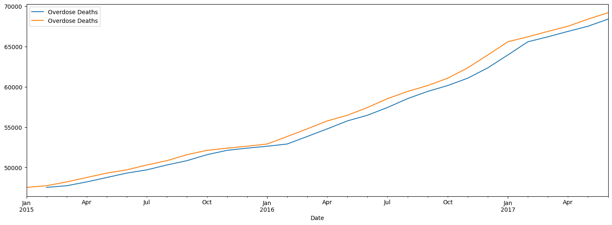
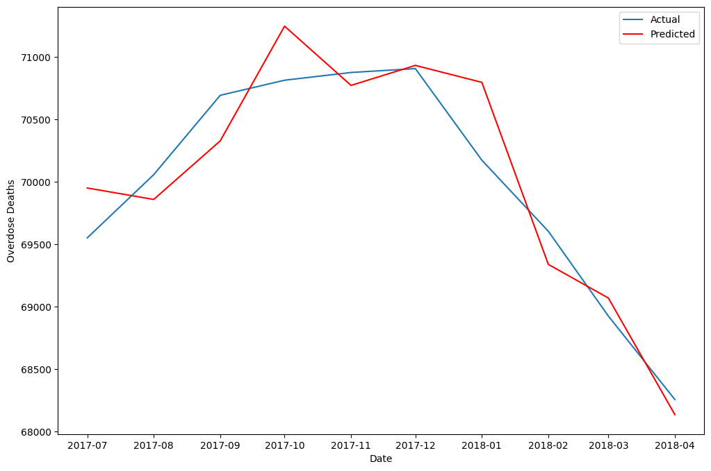

# From Tragedy to Insight: Overdose Deaths in America
This project aims to develop a time series forecasting model to predict the number of deaths per month due to drug overdose. The forecasting model will provide accurate predictions for all 50 of the United States, Washington D.C., and New York City.

## Stakeholder: Policy Makers & Government Officials

The stakeholder for this project is policymakers and government officials. They will use the predictions generated by the time series forecasting model to inform policy decisions related to the allocation of resources to combat the disease. This will translate into federal and state funding for treatment facilities and harm reduction medicine. It is important that the model is accurate and reliable, as the decisions made based on its predictions could have significant impacts on public health and safety.

## Time Series Forecasting Overview

Time series modeling and forecasting is a statistical technique used to analyze data collected over time. Its main objective is to understand patterns and trends in the data to make future predictions. The process typically involves data collection, preprocessing, analysis, model selection, model training, model validation, and forecasting.

Data collection involves gathering data over regular or irregular intervals. Data preprocessing involves cleaning and preparing the data by addressing missing values, outliers, and other quality issues. Time series analysis is used to identify patterns and trends in the data, while model selection involves choosing a model that best fits the data. Model training is used to estimate the parameters of the selected model using historical data, while model validation is used to evaluate the accuracy of the model by comparing predicted values to actual values.

Time series modeling and forecasting can be applied to various fields, including finance, economics, weather forecasting, and sales forecasting. It is an essential tool for decision-making based on historical data and predicting future outcomes. These are the models typically used for time series modeling.

### Naive Model
The naive model assumes that the future value of the time series is equal to the last observed value. This model is easy to implement and can serve as a baseline for more complex models.

### ARIMA Model
The Autoregressive Integrated Moving Average (ARIMA) model is a more sophisticated method that takes into account the autocorrelation and trend in the time series. This model has three parameters: p (order of autoregression), d (order of differencing), and q (order of moving average).

### SARIMA Model
The Seasonal Autoregressive Integrated Moving Average (SARIMA) models are similar to ARIMA models, but are used to model seasonal time series data.

### ETS Model
Exponential Smoothing State Space Model (ETS) models are used to model time series data that have a trend and/or seasonality. ETS models can be used for forecasting.

### VAR Model
Vector Autoregression (VAR) is used to model multivariate time series data, where two or more time series are analyzed simultaneously.

### BSTS Model
Bayesian Structural Time Series (BSTS) models are Bayesian models that are used to model time series data with a hierarchical structure, and can incorporate both time-varying and time-invariant covariates.

## Data Overview

This dataset provides provisional counts for drug overdose deaths in the United States based on data from the National Vital Statistics System spanning from January 2015 to April 2018.. The data includes national-level counts as well as counts for individual jurisdictions, such as states and the District of Columbia. The counts are reported on a monthly basis and include both reported and predicted provisional counts.
The provisional data includes counts of reported and predicted provisional drug overdose deaths, percentage changes in drug overdose deaths for the current 12-month period compared to the same period in the previous year, and counts of drug overdose deaths involving specific drugs or drug classes. The counts represent the number of deaths due to drug overdose occurring in the 12-month periods ending in the specified month, and are insensitive to seasonal variations. However, it's important to note that provisional data are often incomplete and subject to reporting delays, which may result in underestimation of drug overdose deaths. The dataset also includes data quality metrics, such as percent completeness in overall death reporting and percentage of deaths with cause of death pending further investigation, to aid in the interpretation of the provisional data.

## Modeling

There are many methods for time series forecasting, but we will focus on two of the most commonly used ones: Naive and ARIMA models.

### Baseline (Naive)
Naive shift or naive forecasting is a simple time series forecasting method where the forecast for the next time period is equal to the actual value of the current time period. In other words, it assumes that the future values of the time series will be the same as the most recent observed values. This method is easy to implement and can be useful as a baseline to compare the performance of more advanced forecasting methods. However, it is not suitable for time series with complex patterns or trends, and its accuracy may be affected by seasonality and other external factors. Here, we did a shift on our training data.

### ARIMA
This is a powerful technique to analyze and forecast a wide range of time series data. ARIMA models are commonly used in various fields such as finance, economics, and engineering to forecast stock prices, demand for products, and energy consumption. They are widely available in many statistical software packages and are highly flexible in terms of model selection and parameter tuning. In order to make this data stationary, I had to find the log and difference of the training data. From there, the ARIMA model was utilized and then refined.

## Conclusion

This time series modeling approach, utilizing the naive baseline and two ARIMA models to optimize accuracy, presents a promising step towards predictive modeling. While this methodology is not devoid of limitations and remains open to further refinement.
However, it is crucial to recognize that this modeling approach did not consider the exponential increase of fentanyl and carfentanil in illegal drugs from 2019 onwards, a significant trend that could considerably impact the accuracy of your predictions in the realm of drug-related overdoses. Moreover, the unforeseen circumstance of the global pandemic of COVID-19, characterized by unprecedented levels of unemployment and government stimulus checks, could have disrupted the underlying patterns of the data, introducing additional complexity to the modeling process. In order to ensure the validity and efficacy of your modeling, it may be necessary to explore alternative data sources and sophisticated modeling methodologies that account for these complex factors, and facilitate the generation of more precise and reliable predictions.
